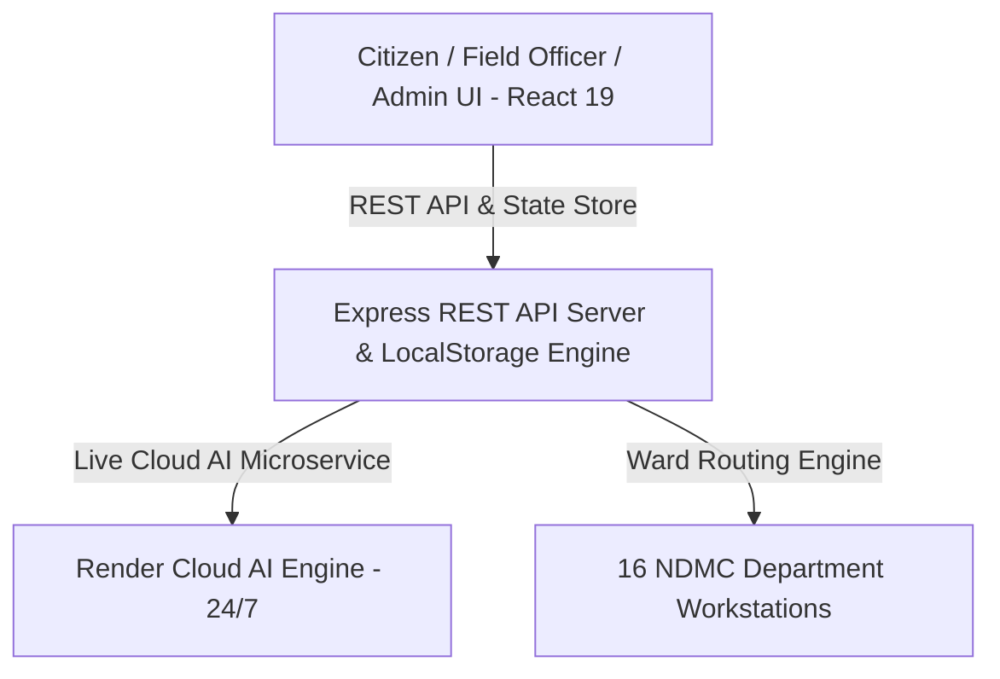

# 🏛️ NagrikAI — Smart Civic Governance Platform for NDMC

[](https://github.com/cyscodic/NagrikAI)
[](https://react.dev/)
[](https://tailwindcss.com/)
[](https://expressjs.com/)
[](https://nagrikai-ahtq.onrender.com)
[](https://github.com/cyscodic/NagrikAI)

**NagrikAI** is an AI-powered, multi-tenant citizen complaint management web platform built specifically for the **New Delhi Municipal Council (NDMC)**. It automates civic grievance intake, natural language intent classification, priority detection, duplicate complaint merging, SLA enforcement, and executive governance analytics.

---

## 🌟 Key Features & Capabilities

### 👤 1. Citizen Portal & Guided Intake Wizard
- **Natural Language Intake**: Citizens describe civic problems in casual Hinglish, Devanagari Hindi, or English without needing technical jargon.
- **4-Step Guided Filing**: Intuitively guides users through Problem Intake ➔ Ward/Location Selection ➔ Photo Evidence ➔ AI Triage Summary.
- **100% Bilingual Accessibility**: Enforces English and Devanagari Hindi typography across all screens.
- **Live Ticket Tracker**: Search grievances by Reference ID (e.g. `NDMC-2026-ELEC-4921`) or Phone Number with live SLA countdown timers and step-by-step resolution logs.

---

### 🤖 2. Cloud AI Microservice Integration (`https://nagrikai-ahtq.onrender.com`)
- **Live Intent Classifier (`POST /api/ai/classify`)**: Auto-categorizes citizen text across 16 NDMC departments with up to **99% precision**.
- **Safety Priority Engine**: Automatically flags life-threatening hazards (live wires, gas leaks, sewage contamination) as **🔴 Critical Priority (2-Hour SLA Target)**.
- **Vector Duplicate Detector (`POST /api/ai/check-duplicate`)**: Uses ChromaDB / Pinecone semantic embeddings to detect and link duplicate complaints within ward boundaries over a 72-hour window.
- **NagrikAI Chatbot Assistant (`POST /api/ai/chat`)**: RAG-powered conversational agent assisting citizens 24/7 with municipal helplines (1533) and ticket tracking.

---

### 🏛️ 3. 16 NDMC Municipal Departments Directory
Fully configured administrative taxonomy with customized category codes and critical SLA targets:
1. `ELEC` — Electricity & Streetlighting (Critical SLA: 2 Hours)
2. `CIVIL` — Civil Engineering & Roads (Critical SLA: 4 Hours)
3. `PH` — Public Health & Sanitation (Critical SLA: 4 Hours)
4. `HORT` — Horticulture & Public Parks (Critical SLA: 4 Hours)
5. `FIRE` — Fire & Disaster Emergency (Critical SLA: 1 Hour)
6. `MED` — Medical Services & Dispensaries (Critical SLA: 2 Hours)
7. `AYUSH` — Ayush Dispensaries & Wellness (Critical SLA: 4 Hours)
8. `ENF` — Municipal Enforcement & Hawkers (Critical SLA: 8 Hours)
9. `PARK` — Parking Management & Traffic (Critical SLA: 8 Hours)
10. `PTAX` — Property Tax & Revenue (Standard SLA: 48 Hours)
11. `HOUS` — Municipal Housing & Colony Care (Critical SLA: 4 Hours)
12. `TRANS` — Transport & Bus Stops (Critical SLA: 4 Hours)
13. `SEC` — Security & CCTV Surveillance (Critical SLA: 1 Hour)
14. `EDU` — Education & NDMC School Facilities (Critical SLA: 8 Hours)
15. `WELF` — Social Welfare & Pensions (Standard SLA: 48 Hours)
16. `EST` — Estate & Lease Allotments (Standard SLA: 48 Hours)

---

### 👨‍💼 4. Enterprise Workstations & Executive Dashboards
- **Field Officer Workstation (`/officer/dashboard`)**: Dedicated queue manager for field engineers to transition ticket statuses (`In Progress` ➔ `Resolved`) with on-site verification notes.
- **Super Admin Command Center (`/admin/dashboard`)**: Executive matrix displaying overall SLA compliance rate %, active escalations, and department performance heatmaps.

---

## 🛠️ Architecture & Technology Stack



### Full-Stack Specifications
- **Frontend**: React 19.2, Vite 8.2, TailwindCSS v4, Lucide React, Recharts.
- **Backend API**: Node.js v24, Express v4, CORS middleware (`server/index.js`).
- **AI Microservice**: Live cloud host on Render (`https://nagrikai-ahtq.onrender.com`).
- **Persistence**: Dual LocalStorage client-side persistence and Express REST API.

---

## 🚀 Quick Start & Installation

### 1. Clone Repository
```bash
git clone https://github.com/cyscodic/NagrikAI.git
cd NagrikAI
```

### 2. Install Frontend Dependencies
```bash
npm install
```

### 3. Install Server Dependencies
```bash
cd server
npm install
cd ..
```

### 4. Run Locally (Single Command)
```powershell
cd D:\NagrikAI\server; Start-Job { node index.js }; cd D:\NagrikAI; npm run dev
```
- **Frontend Web App**: `http://localhost:5173`
- **Backend REST Server**: `http://localhost:5000`

---

## 📋 Team & Responsibility Matrix

| Engineering Area | Primary Lead | Key Deliverables |
| --- | --- | --- |
| **SDE Architecture** | **SDE Lead** | React 19 SPA, Tailwind UI Design System, Node.js Express REST Server, LocalStorage Engine, 3 Dashboards, 16 Dept Taxonomy |
| **AI & Automation** | **AI Lead** | Live Cloud AI Microservice (`render.com`), LLM Intent Classifier, Vector Duplicate Detector, Chatbot RAG Assistant |

---

## 📜 License & Governance
Developed for the **New Delhi Municipal Council (NDMC)** Smart Governance Initiative. All rights reserved. © 2026 NDMC.
